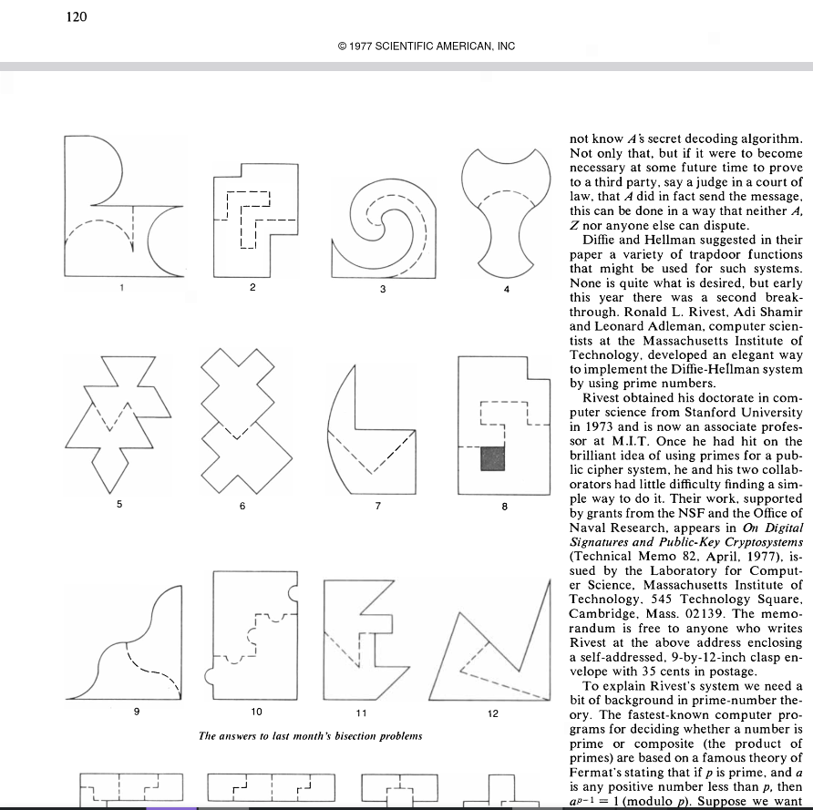

# RSA

The RSA cryptosystem by Ron Rivest, Adi Shamir, and Len Adleman (*[source](https://crypto.stanford.edu/~dabo/papers/RSA-survey.pdf)*) was first publicized in the August 1977 issue of Scientific American. The cryptosystem is used for encryption, decryption, and authenticity via digital signatures.



The cryptosystem was first introduce on page 124: [August, 1977 *Scientific American*](https://wkbpic.com/wkbx/SA/1977/1977-08-01.pdf)


## Textbook RSA

### Notation Definitions

- $N$ is the public key, often referred to as the *public modulus*.
- $p$, $q$ are the two prime factors that make up $N$ (e.g., $N=p\times q$) and are obviously kept private.
- $e$ is commonly referred to as the *public exponent*, which is typically $65537$. As we will see later on in ***Part 2 (coming soon)***, many issues may arise from the use of low public exponents such as $3$ which **used** to be a semi-common choice among programmers until these issued were uncovered and pretty much everyone has stuck with $65537$ as the industry standard.
- $\varphi(N)$ is commonly known and referred to as "phi" or **Euler's totient function**. Read as "phi of N"
- $\pmod N$ is read as "mod $N$".
- $\equiv$ is read as "is congruent to".
- $\mathbb{N}$ means the **natural numbers**, **not** "mod $N$".
- $\mathbb{Z}/N\mathbb{Z}$ is the ring of integers modulo $N$.
- $(\mathbb{Z}/N\mathbb{Z})^\times$ is the multiplicative group of invertible residues modulo $N$.


Below is the algorithm definition as it was originally defined with examples, note that there has been many variations + optimized versions made. RSA-CRT is used in nearly every implementation due to optimizations, and padding schemes have been created such as RSA-OAEP to make RSA more secure against certain attacks. This post will not go over timing attacks and there intricacies and how to defend against them.

### 1) Key Generation

Pick two large primes:

- $p, q$ are large primes (for example, 1024-bit each)

Compute the public modulus:

$$
N = p \times q
$$

Compute **Euler’s totient function**:

$$
\varphi(N) = (p-1)(q-1)
$$

Pick a public exponent $e$ such that:

- $1 < e < \varphi(N)$
- $\gcd(e, \varphi(N)) = 1$

In practice, most systems use:

- $e = 65537 = 2^{16} + 1$

Compute the private exponent $d$ as the modular inverse of $e$ modulo $\varphi(N)$:

$$
d \equiv e^{-1} \pmod{\varphi(N)}
$$

```python
phi = (p-1)*(q-1)
d = pow(e, -w, phi) # built-in modular inverse
```

So the keys are:
- **Public key:** $(N, e)$
- **Private key:** $(N, d)$, together with knowledge of $p, q$

As a quick toy example from scratch demonstrating this

```python
from Crypto.Util.number import getPrime, long_to_bytes \
as l2b
p = getPrime(1024)
q = getPrime(1024)
n = p*q
phi = (p - 1) * (q - 1)
d = pow(e, -1, phi)
e = 65537
assert 1 < e < phi
m = b'hi'
mi = int.from_bytes(m, 'big')
ct = pow(mi, e, n)
pt = pow(ct, d, n)
print(f"m: {m}\nct: {ct}\npt: {l2b(pt)}")
```

### 2) Standard RSA Encryption

Let the plaintext be an integer $m$ where $0 \le m < N$.

Compute the ciphertext:

$$
c \equiv m^e \pmod N
$$

This is the standard textbook RSA encryption equation.

---

### 3) Standard RSA Decryption

Given ciphertext $c$, decrypt with:

$$
m \equiv c^d \pmod N
$$

Then convert $m$ back into bytes to recover the original message.

---

## Why RSA Works

The ambient structure is the ring:
$$
\mathbb{Z}/N\mathbb{Z}
$$

But the clean correctness proof lives in the multiplicative group of invertible residues:
$$
(\mathbb{Z}/N\mathbb{Z})^\times
$$

These are exactly the residue classes $[x]$ such that:
$$
\gcd(x, N) = 1
$$

If $m$ is coprime to $N$, then Euler’s theorem says:
$$
m^{\varphi(N)} \equiv 1 \pmod N
$$

Since RSA chooses $d$ such that:
$$
ed \equiv 1 \pmod{\varphi(N)}
$$

there exists an integer $k$ with:
$$
ed = 1 + k\varphi(N)
$$

Therefore:
$$
\begin{aligned}
m^{ed}
&= m^{\,1 + k\varphi(N)} \\[4pt]
&= m\left(m^{\varphi(N)}\right)^k \\[4pt]
&\equiv m \cdot 1^k \pmod N \\[4pt]
&\equiv m \pmod N
\end{aligned}
$$

If you want the same derivation with the “big curly brace” annotation style, use this:
$$
\begin{aligned}
m^{ed}
&= m^{\,1 + k\varphi(N)} \\[4pt]
&= m\left(m^{\varphi(N)}\right)^k \\[4pt]
&\equiv m \cdot
\underbrace{\left(m^{\varphi(N)}\right)^k}_{\substack{\text{by Euler's theorem} \\ m^{\varphi(N)} \equiv 1 \pmod N}}
\pmod N \\[8pt]
&\equiv m \cdot 1^k \pmod N \\[4pt]
&\equiv m \pmod N
\end{aligned}
$$

If you want to explicitly annotate the exponent relation too, use this version:
$$
\begin{aligned}
m^{ed}
&= m^{\underbrace{\,1 + k\varphi(N)\,}_{ed}} \\[4pt]
&= m\left(m^{\varphi(N)}\right)^k \\[4pt]
&\equiv m \cdot
\underbrace{\left(m^{\varphi(N)}\right)^k}_{\substack{m^{\varphi(N)} \equiv 1 \pmod N}}
\pmod N \\[8pt]
&\equiv m \cdot 1^k \pmod N \\[4pt]
&\equiv m \pmod N
\end{aligned}
$$

That is the core reason decryption recovers the original message.

---

## Textbook RSA (Python)

> **Educational only**! \
> Do **not** use in production.

```python
#!/usr/bin/env python3
from Crypto.Util.number import (
    getPrime,
    bytes_to_long,
    long_to_bytes,
    inverse,
    GCD,
)

def keygen(bits=2048, e=65537):
    while True:
        p = getPrime(bits // 2)
        q = getPrime(bits // 2)
        if p == q:
            continue
        N = p * q
        phi = (p - 1) * (q - 1)
        if GCD(e, phi) == 1:
            d = inverse(e, phi)
            return (N, e), (N, d)

def encrypt(msg_bytes, pub):
    N, e = pub
    m = bytes_to_long(msg_bytes)
    return pow(m, e, N)

def decrypt(cipher, priv):
    N, d = priv
    m = pow(cipher, d, N)
    return long_to_bytes(m)

if __name__ == "__main__":
    pub, priv = keygen()
    msg = b"hello rsa"
    c = encrypt(msg, pub)
    print(decrypt(c, priv))
```

> While this is useful for learning purposes, it's not secure for production as previously mentioned as it lacks padding + formal verification and timing/side-channel attack protections. Real deployment use schemes with a significant amount of optimization's, such as RSA-CRT. Everyday RSA usage usually involves the use of a secure padding scheme such as RSA-OAEP and RSA-PSS for digital signatures.

I will be going over both in another post and the history of different padding schemes and previous issues.

---